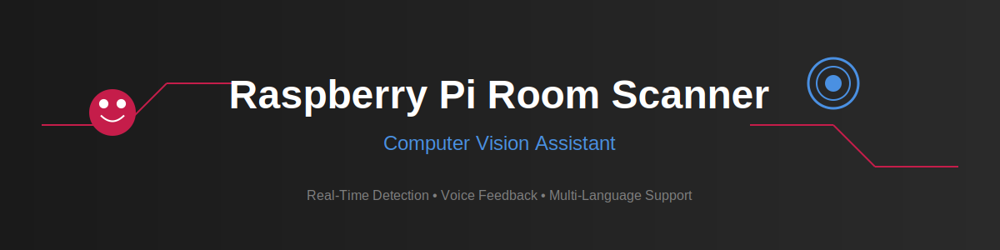

# Raspberry Pi Room Scanner Using Computer Vision




## Description

This project transforms a Raspberry Pi into an intelligent room scanning device that verbally describes detected objects in its environment. Built upon the [Object Detection Educator](https://github.com/faycalki/object-detection-educator) framework, this implementation focuses on creating a portable, button-activated device that provides real-time audio feedback about its surroundings, making it particularly useful for educational purposes or as an assistive technology.

## Features

- **Real-Time Detection**: Instant object detection using YOLOv10 optimized for Raspberry Pi
- **Voice Feedback**: Automatic verbal description of detected objects
- **Hardware Integration**: 
  - Push-button activation for on-demand scanning
  - LED status indicators
  - Integrated audio output
- **Portable Design**: Self-contained system powered by Raspberry Pi
- **Multi-language Support**: Inherits support for 243 languages from the parent project

## Hardware Requirements

### Core Components
- Raspberry Pi 3+ (2GB+ RAM recommended)
- Raspberry Pi Camera Module V2 or better
- Push button (momentary switch)
- 2 LEDs (status indicators)
- Speaker/headphones (3.5mm or USB)
- Jumper wires
- Breadboard
- Power supply (5V/3A recommended)

### Circuit Diagram


## Credits

### Hardware Design
- Faycal Kilali
- Ryan Budd
- Yuezun Shan

### Software Development
- Faycal Kilali (Lead Developer)
- Ryan Budd (Contributor)

### Other citations
Open-source ultralytics package: [YOLOv10 GitHub Repository](https://github.com/THU-MIG/yolov10)
 
Wang, Ao, Chen, Hui, Liu, Lihao, Chen, Kai, Lin, Zijia, Han, Jungong, & Ding, Guiguang. (2024). *YOLOv10: Real-Time End-to-End Object Detection*. arXiv preprint arXiv:2405.14458.

## Installation
Python 3.9 is required.

First, we present two installation scipts. One to setup the pyenv if you haven't, and one to setup the rest.

For setting up pyenv,

```bash
#!/bin/bash

# Pyenv setup
curl https://pyenv.run | bash

# Update shell configuration for pyenv
echo 'export PYENV_ROOT="$HOME/.pyenv"; command -v pyenv >/dev/null || export PATH="$PYENV_ROOT/bin:$PATH"; eval "$(pyenv init -)"' >> ~/.bashrc
echo 'export PYENV_ROOT="$HOME/.pyenv"; command -v pyenv >/dev/null || export PATH="$PYENV_ROOT/bin:$PATH"; eval "$(pyenv init -)"' >> ~/.profile
echo 'export PYENV_ROOT="$HOME/.pyenv"; [[ -d $PYENV_ROOT/bin ]] && export PATH="$PYENV_ROOT/bin:$PATH"; eval "$(pyenv init -)"' >> ~/.bash_profile

exec $SHELL

# Install required build dependencies for Python
sudo apt-get update
sudo apt-get install --yes \
    libssl-dev \
    zlib1g-dev \
    libbz2-dev \
    libreadline-dev \
    libsqlite3-dev \
    llvm \
    libncurses5-dev \
    libncursesw5-dev \
    xz-utils \
    tk-dev \
    libgdbm-dev \
    lzma \
    lzma-dev \
    tcl-dev \
    libxml2-dev \
    libxmlsec1-dev \
    libffi-dev \
    liblzma-dev \
    wget \
    curl \
    make \
    build-essential \
    openssl

# Install Python with pyenv
pyenv update
pyenv install 3.9.0
pyenv global 3.9.0

# Inform user of successful installation
echo "Python 3.9.0 installed successfully with pyenv. Please restart your terminal or run 'source ~/.bashrc' to apply changes."


````

```bash
#!/bin/bash

# Load pyenv in the current shell session
export PYENV_ROOT="$HOME/.pyenv"
export PATH="$PYENV_ROOT/bin:$PATH"
eval "$(pyenv init -)"

# Variables
PROJECT_DIR="$HOME/PycharmProjects/room_scanner"  # Updated to use $HOME
SRC_DIR="$PROJECT_DIR/src"
VENV_DIR="$PROJECT_DIR/.venv"
GIT_REPO="https://github.com/faycalki/room-scanner-rpi.git"
START_SCRIPT="$PROJECT_DIR/start_scripts.sh"
SERVICE_FILE="/etc/systemd/system/room_scanner.service"
TAR_FILE="$SRC_DIR/ultralytics.tar.gz"  # Path to the tar.gz file

# Clone the repository
if [ ! -d "$PROJECT_DIR" ]; then
    echo "Cloning the GitHub repository..."
    git clone $GIT_REPO $PROJECT_DIR || { echo "Failed to clone repository"; exit 1; }
else
    echo "Project directory already exists. Pulling latest changes..."
    cd $PROJECT_DIR
    git pull || { echo "Failed to pull latest changes"; exit 1; }
fi

# Extract the ultralytics.tar.gz file into the src directory
if [ -f "$TAR_FILE" ]; then
    echo "Extracting ultralytics.tar.gz to $SRC_DIR..."
    tar -xzf "$TAR_FILE" -C "$SRC_DIR" || { echo "Failed to extract $TAR_FILE"; exit 1; }
else
    echo "Warning: $TAR_FILE not found. Skipping extraction."
fi

# Create a virtual environment with the pyenv-managed Python 3.9
echo "Creating a virtual environment with Python 3.9..."
python -m venv $VENV_DIR || { echo "Failed to create virtual environment"; exit 1; }

# Activate the virtual environment and install dependencies
echo "Installing Python dependencies..."
source $VENV_DIR/bin/activate
pip install --upgrade pip || { echo "Failed to upgrade pip"; exit 1; }
pip install -r "$PROJECT_DIR/requirements.txt" || { echo "Failed to install requirements"; exit 1; }

# Create the start_scripts.sh file
cat <<EOL > $START_SCRIPT
#!/bin/bash

# Navigate to the directory where your Python scripts are located
cd $SRC_DIR

# Activate the virtual environment
source $VENV_DIR/bin/activate

# Start the Flask backend in the background
python detector.py &

# Wait a few seconds to ensure the Flask server is up
sleep 5

# Run the main script
python main.py
EOL

# Make the script executable
chmod +x $START_SCRIPT

# Create the systemd service file, appropriately named.
cat <<EOL > $SERVICE_FILE

[Unit]
Description=Room Scanner Service
After=multi-user.target

[Service]
ExecStart=$START_SCRIPT
WorkingDirectory=$SRC_DIR
StandardOutput=journal
StandardError=journal
Restart=always
User=$(whoami)  # Use the current user

[Install]
WantedBy=multi-user.target
EOL

# Enable the systemd service
sudo systemctl enable room_scanner.service

echo "Setup complete! Reboot your Raspberry Pi to start the services on boot."

```


Alternatively, if you wish to do it more manually, here are the steps

1. Clone the repository:
    ```bash
    git clone https://github.com/faycalki/room-scanner-rpi.git
    cd pi-room-scanner
    ```

2. Set up Python virtual environment:
    ```bash
    python -m venv env
    source env/bin/activate  # On Windows use `env\Scripts\activate`
    pip install -r requirements.txt
    ```

3. Enable Raspberry Pi camera and GPIO:
    ```bash
    sudo raspi-config
    # Enable Camera under Interface Options
    ```

4. Configure audio output:
    ```bash
    # This will be based on what kind of hardware you use for the audio. Refer to the documentation of your hardware.
    ```

## Usage

### Basic Operation

1. Power on the Raspberry Pi
2. Wait for the red LED to indicate system ready (power is on for the system)
3. Press the button to trigger a room scan (blue LED will trigger)
4. Listen to the voice description of detected objects

Note: if you followed the manual instructions, you will want to run the flask detector.py before you run the main.py file.


